# RAG Chatbot Query Processing Flow

```mermaid
graph TB
    subgraph Frontend[Frontend - Browser]
        A[User Types Query] --> B[script.js: sendMessage]
        B --> C[Show Loading Animation]
        C --> D[POST /api/query]
    end

    subgraph Backend[Backend API Layer]
        D --> E[app.py: query_documents]
        E --> F{Session ID<br/>Exists?}
        F -->|No| G[Create New Session]
        F -->|Yes| H[Use Existing Session]
        G --> I[rag_system.query]
        H --> I
    end

    subgraph RAG[RAG System Core]
        I --> J[Get Conversation History]
        J --> K[Construct Prompt]
        K --> L[ai_generator.generate_response]
    end

    subgraph AI[AI Generation Layer]
        L --> M[Build System Prompt]
        M --> N[Claude API Call<br/>with Tools]
        N --> O{Tool Use<br/>Required?}
    end

    subgraph Search[Search and Retrieval]
        O -->|Yes| P[CourseSearchTool]
        P --> Q[Vector Search<br/>ChromaDB]
        Q --> R[Retrieve Relevant<br/>Course Chunks]
        R --> S[Return to AI]
    end

    O -->|No| T[Direct Response]
    S --> U[Synthesize Response<br/>with Context]
    T --> U

    subgraph Response[Response Processing]
        U --> V[Update Session History]
        V --> W[Extract Sources]
        W --> X[Return answer and sources]
    end

    subgraph APIResp[API Response]
        X --> Y[Package QueryResponse]
        Y --> Z[JSON Response to Frontend]
    end

    subgraph Display[Frontend Display]
        Z --> AA[Remove Loading]
        AA --> AB[Render Markdown]
        AB --> AC[Display Sources]
        AC --> AD[Re-enable Input]
    end

    style A fill:#e1f5e1
    style AD fill:#e1f5e1
    style N fill:#ffe4e1
    style Q fill:#e1e4ff
```

## Component Details

### 1. **Frontend Layer** 📱
- **File**: `frontend/script.js`
- **Key Functions**: `sendMessage()`, `addMessage()`, `createLoadingMessage()`
- **Data Format**: JSON with query and session_id

### 2. **API Gateway** 🌐
- **File**: `backend/app.py`
- **Endpoint**: `POST /api/query`
- **Models**: `QueryRequest`, `QueryResponse`
- **Session Management**: Creates/maintains session IDs

### 3. **RAG Orchestration** 🎯
- **File**: `backend/rag_system.py`
- **Function**: `query()`
- **Coordinates**: Document processor, vector store, AI generator, session manager

### 4. **AI Generation** 🤖
- **File**: `backend/ai_generator.py`
- **Model**: Claude (Anthropic)
- **Features**: Tool usage, conversation context, system prompts

### 5. **Search Tools** 🔍
- **File**: `backend/search_tools.py`
- **Tool**: `CourseSearchTool`
- **Backend**: ChromaDB vector database

### 6. **Vector Store** 💾
- **File**: `backend/vector_store.py`
- **Collections**: 
  - `course_catalog`: Course metadata
  - `course_content`: Chunked content with embeddings
- **Embedding Model**: SentenceTransformer

## Data Flow

1. **User Input** → Query text
2. **API Request** → `{query: str, session_id: str?}`
3. **Vector Search** → Semantic similarity matching
4. **Context Building** → Relevant chunks + history
5. **AI Processing** → Claude generates response
6. **Response** → `{answer: str, sources: List[str], session_id: str}`

## Key Features

- ✅ **Session Persistence**: Maintains conversation context
- ✅ **Semantic Search**: Vector embeddings for relevance
- ✅ **Source Attribution**: Tracks information origin
- ✅ **Tool-based Architecture**: Modular search capabilities
- ✅ **Async Processing**: Non-blocking frontend
- ✅ **Error Handling**: Graceful failure recovery